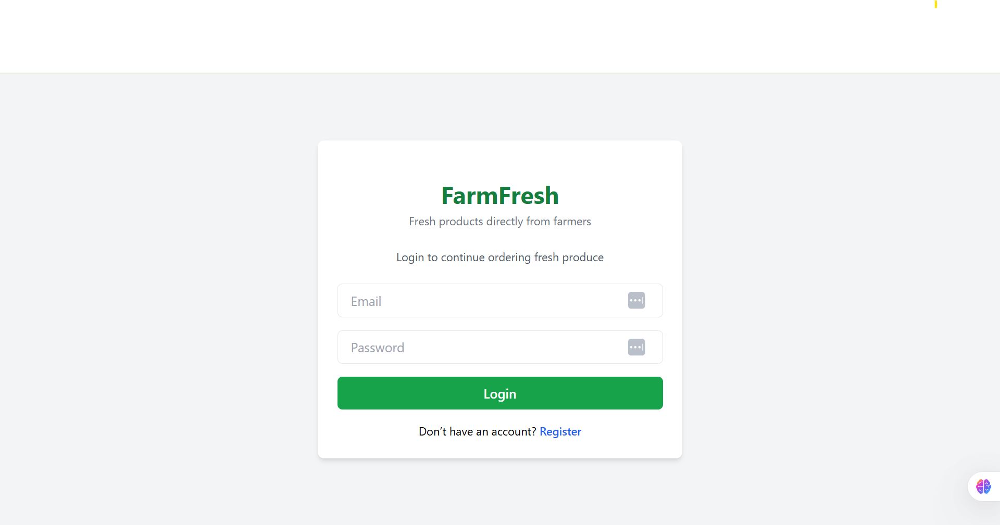
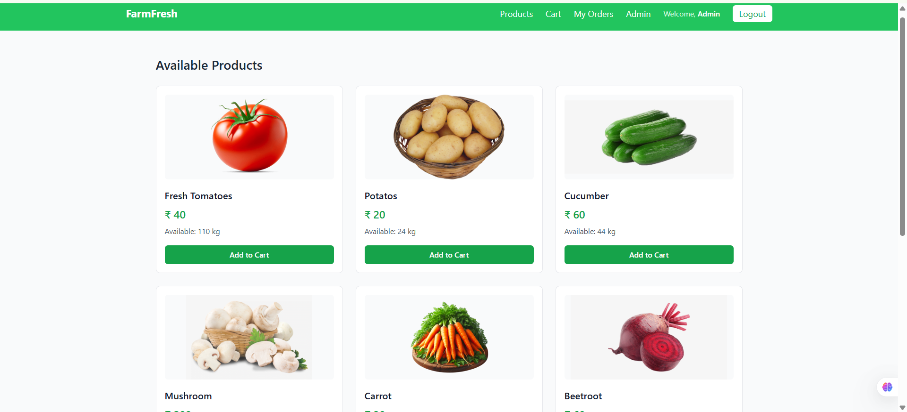
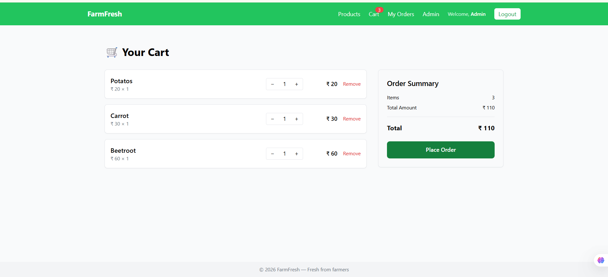
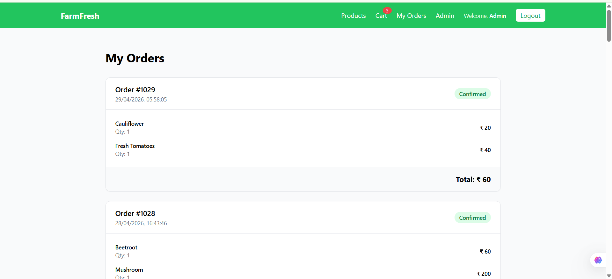
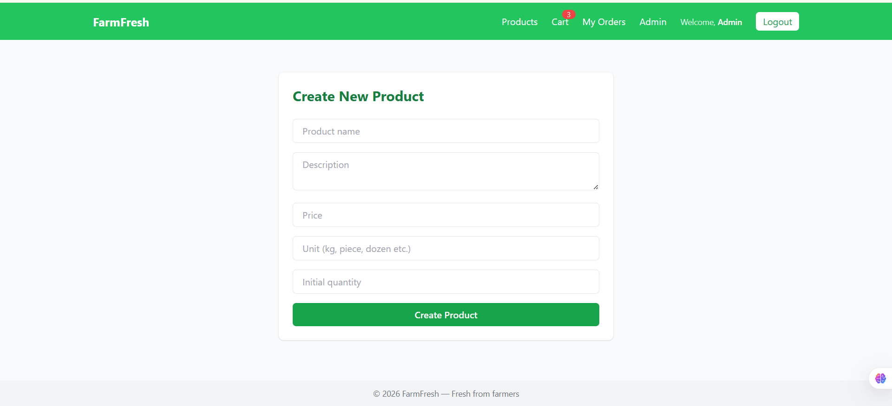

# 🌱 FarmFresh – Full Stack E-Commerce Ordering Platform

<p align="center">
  A production-style full stack web application built using <b>ASP.NET Core Web API</b>, <b>React</b>, and <b>SQL Server</b> for local farm-to-home product ordering.
</p>

<p align="center">
  
  
  
  
  
</p>

---

# 📌 Overview

FarmFresh is a real-world full stack e-commerce platform designed for local fresh produce businesses.

It enables customers to browse products, add items to cart, place orders, and view order history.  
Admins can manage products, inventory, and business operations securely.

This project was built to simulate a **production-grade ordering system** while following modern software engineering practices.

---

# 🚀 Key Features

## 👨‍🌾 Customer Features

✅ User Registration & Login  
✅ JWT Authentication  
✅ Browse Available Products  
✅ Add to Cart  
✅ Update Quantity  
✅ Remove Items from Cart  
✅ Place Orders  
✅ Beautiful Success / Error Popups  
✅ My Orders Page  
✅ Premium Order History UI  

---

## 🛠️ Admin Features

✅ Admin Login  
✅ Add New Products  
✅ Edit Products  
✅ Inventory Management  
✅ Activate / Deactivate Products  
✅ Order Monitoring Ready  

---

# 🧱 Tech Stack

## Backend

- C#
- ASP.NET Core Web API
- Entity Framework Core
- LINQ
- SQL Server
- JWT Authentication
- Dependency Injection
- Clean Architecture
- Async / Await

## Frontend

- React
- TypeScript
- Tailwind CSS
- Axios
- Context API
- React Router

---

# 🏗️ Architecture

```text
React Frontend
      ↓
REST API (.NET Core)
      ↓
Controllers
      ↓
Service Layer
      ↓
Entity Framework Core
      ↓
SQL Server Database

🔐 Security Implementation

✅ JWT Token Based Authentication
✅ Role Based Authorization
✅ Protected APIs
✅ Secure Route Navigation
✅ Login Session Handling

FarmFresh/
│
├── backend/
│   ├── FarmFresh.API
│   ├── FarmFresh.Application
│   ├── FarmFresh.Domain
│   ├── FarmFresh.Infrastructure
│   └── FarmFresh.sln
│
├── frontend/
│   └── farmfresh-ui
│
└── README.md

⚙️ Run Locally
Clone Repository
git clone https://github.com/pk-101/FarmFresh-FullStack-ECommerce-App.git

Backend Setup
cd backend
dotnet restore
dotnet run

Frontend Setup
cd frontend/farmfresh-ui
npm install
npm run dev

💾 Database Features

✅ Relational Design
✅ Products Table
✅ Orders Table
✅ OrderItems Table
✅ Inventory Table
✅ User Authentication Tables
✅ EF Core Migrations

🌟 Real Engineering Concepts Used
Clean Architecture
Layered Design
SOLID Principles
Dependency Injection
REST API Design
Async Programming
Transaction Handling
State Management
Secure Authentication
Reusable Components

📸 Screenshots







🔮 Future Enhancements

✅ Razorpay Payment Gateway
✅ Email Notifications
✅ Delivery Tracking
✅ Dashboard Analytics
✅ Docker Deployment
✅ Azure Hosting
✅ Mobile App Version

👨‍💻 Author

Pankaj Kumar
Full Stack .NET Developer
Passionate about building real products with technology 🚀

⭐ If you like this project, give it a star!
